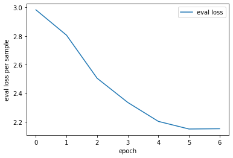

### Issue with data

```
wc -l data/*
  2000 test_source.txt
  2000 test_target.txt
  7260 train_source.txt
  5539 train_target.txt
 16799 total
```

as the train_source and train_target files had a different number of lines I chose to simply look at the first 5539 lines of train_source.txt after contacting dl_papago_mt_recruit@navercorp.com via email.

## Model

Some ideas for the model were taken from [here](https://pytorch.org/tutorials/intermediate/seq2seq_translation_tutorial.html)

### Encoder

RNN Encoder using an embedding layer and gated recurrent units.

### Decoder

* **Attentional Mechanism** builds queries from output sequence produced so far and <key,value> pairs from the encoded input to build an indexing scheme of interesting information to look up.

* **Drop-out** picks random nodes to not be part of the graph to decrease the dependency on single paths and increase robustness

* **Teacher-forcing** makes the model sometimes use the target sequence during training to give the decoder a high quality input. Can lead to faster convergence.
## Evaluation Metric

At every step the decoder produces a tensor which for every token gives a (unnormalized) probability for this token to be the next in the output sequence. (logit)

This probability distribution is compared with the output symbol we expect according to ground truth using **negative log-likelihood**:

```math
  Loss = -log(p_i) 

  where p_i is softmax of ground truth token 
  over all possible tokens
```
## Experimental Results

Average negative log likelihood loss per sample over the hold-out evaluation set for 5 epochs:



Some sample outputs produced by the model for source and target sentences from the evaluation set:

source [311, 437, 35, 327, 659]  
target [276, 85, 659]  
model 276 85 <EOS>  

source [29, 105, 416, 416, 68, 311, 584, 342, 68, 35, 437, 437, 68, 78, 437, 68, 200, 402, 200, 105, 157, 113, 659]  
target [165, 68, 5, 68, 330, 68, 517, 68, 189, 451, 659]  
 model 165 68 5 68 85 68 68 68 68 <EOS>

source [33, 200, 33, 437, 95, 659]  
target [447, 158, 290, 659]  
 model 447 290 <EOS>

source [35, 140, 342, 304, 304, 311, 659]  
target [85, 299, 4, 659]  
 model 85 222 222 222 222 <EOS>

source [140, 227, 437, 68, 304, 95, 584, 157, 140, 68, 584, 304, 68, 52, 105, 140, 311, 68, 227, 200, 416, 416, 659]  
target [569, 68, 240, 643, 359, 68, 640, 68, 330, 222, 68, 218, 659]  
 model 569 68 240 643 359 68 638 68 222 476 <EOS>

source [200, 157, 35, 29, 437, 95, 659]  
target [246, 204, 659]  
 model 273 101 86 <EOS>

Looking at these sample outputs we see that the model started to learn a reasonable mapping. However clearly many improvements are possible:

## To improve

There are many things to improve:

* more training runs with different hyper-parameters:
  * learning rate
  * scheduler
  * size of hidden representation
  * dropout ratio
  * teacher student forcing ratio

* some sentences are very long: deal with this for example by removing some outliers from training set.

* implement batching, and therefore first an efficient padding algorithm

* I'm unsure how efficient the encoded sequence is, check whether it can be encoded more efficiently once more

## Task Description

The objective of this task is to create a model that approximates a mapping function from an input sequence of integers ("source") to an output sequence of integers ("target") using a training data set (`train_source.txt`, `train_target.txt`), and achieve best generalization performance on a held-out test set (`test_source.txt`, `test_target.txt`). Use any technique and framework you think is appropriate. 

Please submit a link to a GitHub repository, containing your code, and `README` which describes the following:

1. your experiment design (including baselines and models and/or data exploration results)
2. evaluation metrics
3. experimental results.
